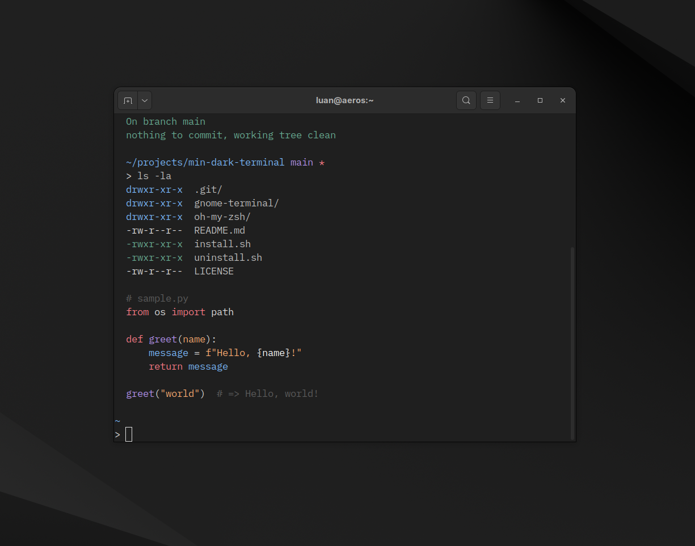

# Min Dark Terminal

A port of [Min Theme](https://github.com/miguelsolorio/min-theme) by **Miguel Solorio** for terminal emulators and shell prompts.

The original Min Theme is a minimal VS Code color theme. This project brings the same aesthetic to your terminal.



## Color Palette

| Color   | Normal    | Bright    |
|---------|-----------|-----------|
| Black   | `#1A1A1A` | `#5C5C5C` |
| Red     | `#FF7A84` | `#FF9DA6` |
| Green   | `#67AB91` | `#89C4AA` |
| Yellow  | `#FFAB70` | `#FFC08F` |
| Blue    | `#79B8FF` | `#9ECBFF` |
| Magenta | `#B392F0` | `#C9B0F5` |
| Cyan    | `#7CAFC2` | `#9CC5D5` |
| White   | `#E0E0E0` | `#FFFFFF` |

| Element    | Color     |
|------------|-----------|
| Background | `#1F1F1F` |
| Foreground | `#C0C0C0` |
| Bold       | `#FAFAFA` |
| Cursor     | `#E0E0E0` |
| Selection  | `#363636` |

## Supported Targets

- **GNOME Terminal** — color profile via `dconf`
- **Oh My Zsh** — minimal prompt theme

## Requirements

- **GNOME Terminal**: `dconf-cli` and `uuid-runtime`
- **Oh My Zsh**: [Oh My Zsh](https://ohmyz.sh/) installed

## Installation

### Quick Install

```bash
git clone https://github.com/luan-coelho/min-dark-terminal.git
cd min-dark-terminal
./install.sh --all --default --update-zshrc
```

### GNOME Terminal Only

```bash
./install.sh --gnome --default
```

### Oh My Zsh Only

```bash
./install.sh --zsh --update-zshrc
```

Or manually: copy `oh-my-zsh/min-dark.zsh-theme` to `~/.oh-my-zsh/custom/themes/min-dark/` and set `ZSH_THEME="min-dark/min-dark"` in your `.zshrc`.

### Options

| Flag              | Description                              |
|-------------------|------------------------------------------|
| `--all`           | Install GNOME Terminal + Oh My Zsh theme |
| `--gnome`         | Install GNOME Terminal profile only      |
| `--zsh`           | Install Oh My Zsh theme only             |
| `--default`       | Set as default GNOME Terminal profile    |
| `--update-zshrc`  | Update `.zshrc` to use the theme         |

## Uninstall

```bash
./uninstall.sh
```

Removes the GNOME Terminal profile and Oh My Zsh theme. Resets `ZSH_THEME` to `robbyrussell` if it was set to `min-dark`.

## Prompt Preview

```
~/projects/my-app main *
>
```

- Directory in blue (`#79B8FF`)
- Git branch in magenta (`#B392F0`)
- Dirty indicator in red (`#FF7A84`)
- Prompt `>` in white (gray on success, red on error)
- Non-zero exit codes shown on the right

## Credits

- Original theme: [Min Theme](https://github.com/miguelsolorio/min-theme) by [Miguel Solorio](https://github.com/miguelsolorio)
- Windows Terminal port reference: [min-windows-terminal](https://github.com/mohvn/min-windows-terminal)

## License

[MIT](LICENSE)
